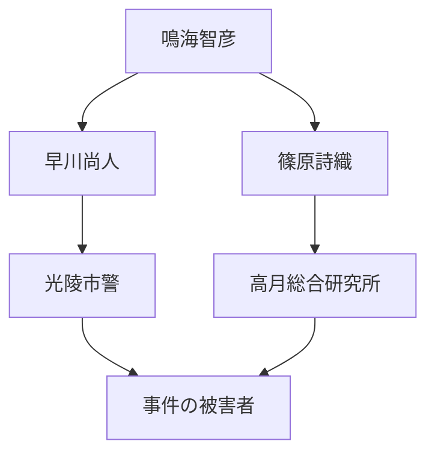

# 設計書

## テーマ
AIと人間の共存、倫理的ジレンマ、真実の追求

## コンセプト
プレイヤーの選択によって展開が変わるインタラクティブなサスペンスノベル。AI技術と人間の感情が交錯する物語。

## ストーリー構成
1. **序章**: 光陵市での事件発生と主要キャラクターの紹介
2. **展開**: 事件の捜査とAI技術の活用
3. **クライマックス**: 真実の発見と倫理的問題の対峙
4. **結末**: プレイヤーの選択による複数のエンディング

## ストーリー相関図

## 執筆スケジュール
- **第1週**: プロット作成
- **第2週**: キャラクター設定
- **第3週**: 初稿執筆
- **第4週**: 編集と修正
- **第5週**: 最終確認とリリース